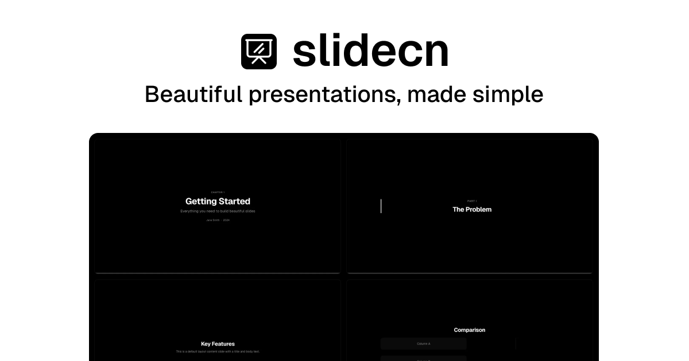

<h1 align="center">slidecn</h1>

  Free & open-source, ready-to-use, customizable presentation components for React. 
  Zero config. One command setup. Built on <a href="https://revealjs.com/">reveal.js</a>, works seamlessly with <a href="https://ui.shadcn.com/">shadcn/ui</a>.

  <a href="https://slidecn.dev/docs">Get Started</a> ·
  <a href="https://slidecn.dev/docs/installation">Installation</a> ·
  <a href="https://slidecn.dev/docs/components">Components</a>

 

  

## Features

- 🎯 **Zero config** — Works out of the box with sensible defaults
- 🎨 **Theme-aware** — Automatically adapts to your chosen slide theme
- 📦 **shadcn/ui compatible** — Uses the same registry format and CLI
- 🧩 **Composable** — Build complex presentations with simple, declarative components
- 🗂️ **Pre-built decks** — Blocks for PitchDeck, TechTalk, ProductDemo, and WeeklyReport
- 🔄 **Transitions & motion** — None, fade, slide, convex, concave, and zoom; fragments for step-by-step reveals
- 📊 **Code on slides** — Shiki syntax highlighting with line numbers and copy-to-clipboard
- ⌨️ **reveal.js powered** — Full access to the reveal.js deck model, keyboard navigation, and presenter flow

## Contributing

Contributions are welcome! Please feel free to submit a Pull Request.

1. Fork the repository
2. Create your feature branch (`git checkout -b feature/amazing-feature`)
3. Commit your changes (`git commit -m 'Add some amazing feature'`)
4. Push to the branch (`git push origin feature/amazing-feature`)
5. Open a Pull Request

## License

[MIT](LICENSE)

## Star History

<a href="https://www.star-history.com/?repos=shadcn-labs%2Fslidecn&type=date&legend=top-left">
 <picture>
   <source media="(prefers-color-scheme: dark)" srcset="https://api.star-history.com/chart?repos=shadcn-labs/slidecn&type=date&theme=dark&legend=top-left" />
   <source media="(prefers-color-scheme: light)" srcset="https://api.star-history.com/chart?repos=shadcn-labs/slidecn&type=date&legend=top-left" />
   
 </picture>
</a>
